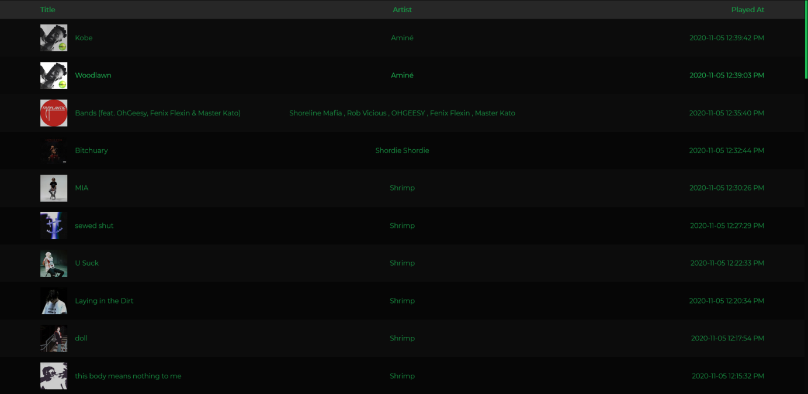

# Spotify Persistent History
## Because Spotify doesn't offer an easy way to see your song history

### How it works
Spotify actually keeps a list of the last 50 songs you listened. Anything you listened to for 30+ seconds is added to this list 
So every 30\*50 seconds it retrieves your history and adds it to a database (MongoDB) 
It then retrieves those records and displays them to you in your browser 
Note that it deletes records that are 3 months of age (or older)

### Requirments
This is made by a dev for devs. It is not made to be average user friendly.  
You will need:

- A MongoDB (local or not, I used the free tier of [MongoDB Atlas](https://www.mongodb.com/cloud/atlas))
- A Spotify dev account

### Set Up
Make a .env file and add the following fields:

| Field Name     | What it is                        |
|--------------|------------------------------|
| DB_UNAME  	 | Your MongoDB username             |
| DB_PASS		 | Your MongoDB password             |
| CLIENT_ID	     | Your Spotify dev account's ID     |
| CLIENT_SECRET  | Your Spotify dev account's secret |

 
Then, go to the root folder and run
- `npm run n`
- `npm run m` (order doesn't really matter, but make sure you run both)
 
Then head to `https://localhost:8888` IMPORTANT: make sure it is https 
Click the big green button 
It should then redirect you to the page that displays your song history (if the page is empty / blank, just reload it)

### What it looks like
